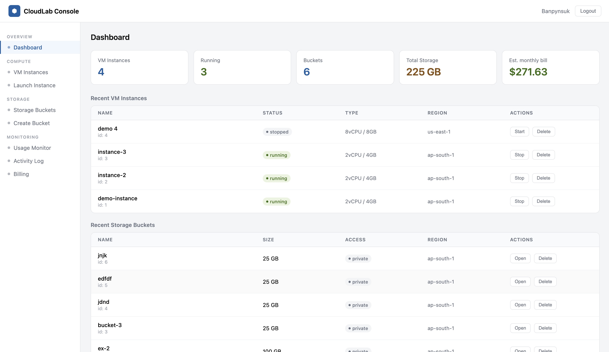
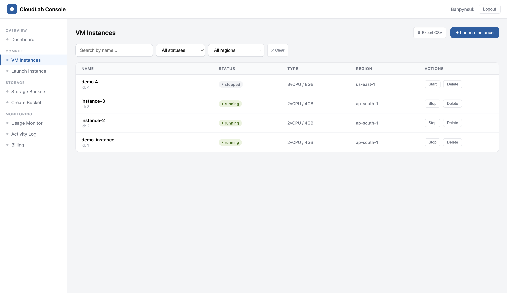
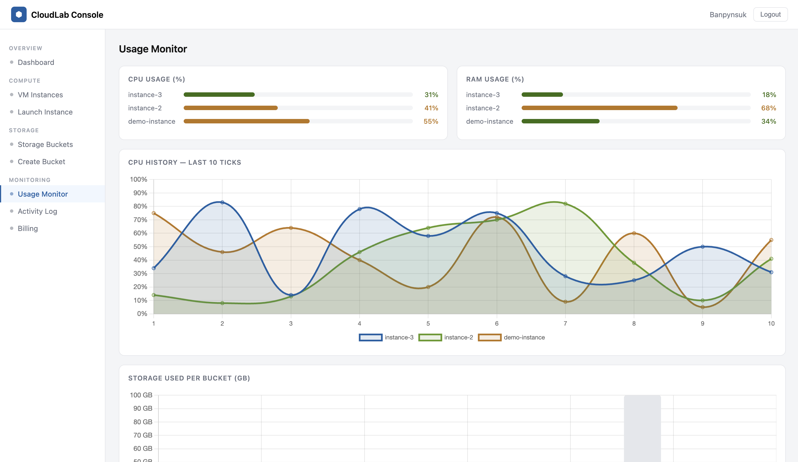
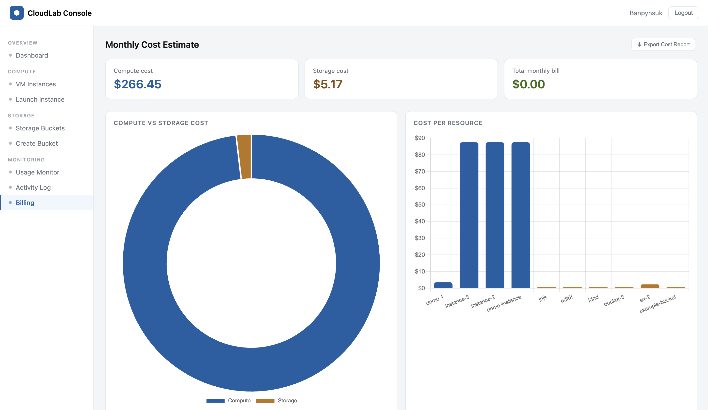
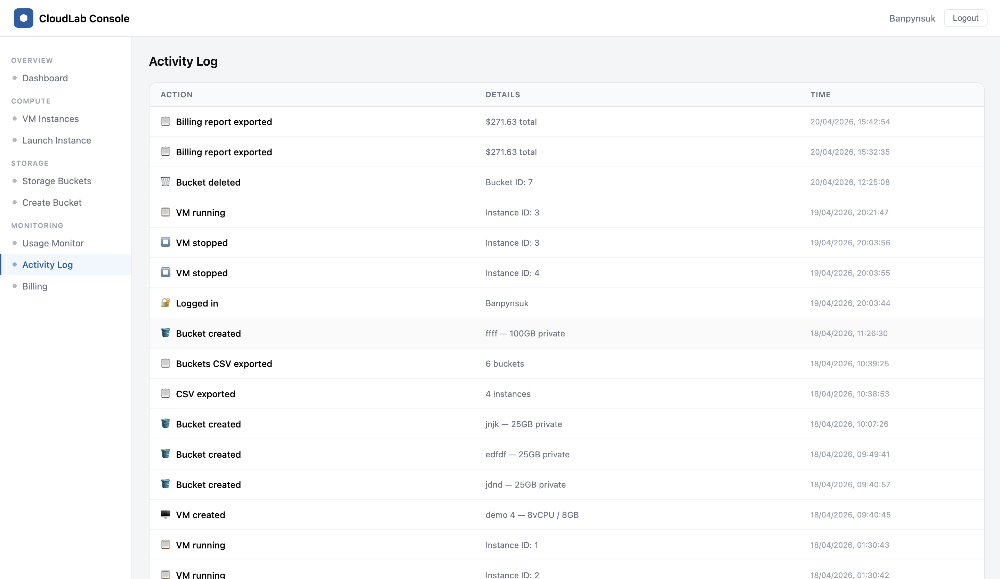
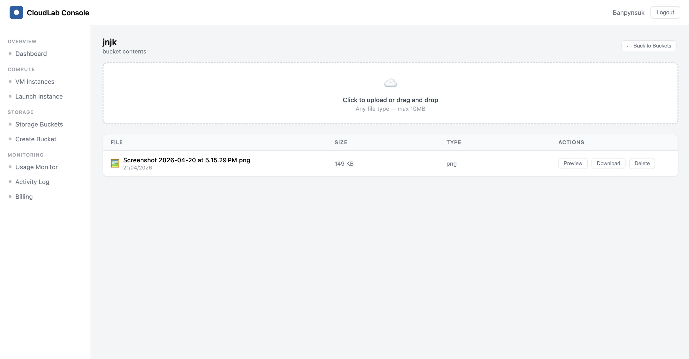

# ☁️ CloudLab Simulator

> A full-stack cloud infrastructure simulator inspired by AWS — built with PHP, MySQL, and Chart.js.

---

## 🔗 Live Demo

> Coming soon — deploying on Render + Vercel

---

## 📸 Screenshots

| Dashboard | VM Instances | Monitor |
|-----------|-------------|---------|
|  |  |  |

| Billing | Activity Log | Bucket Files |
|---------|-------------|-------------|
|  |  |  |

---

## ✨ Features

### Core
- 🔐 **Authentication** — register, login, logout with bcrypt hashed passwords
- 💻 **VM Instances** — create, start, stop, and delete virtual machines
- 🪣 **Storage Buckets** — create and manage cloud storage buckets
- 📁 **File Uploads** — upload, preview, download, and delete files inside buckets
- 👤 **Per-user isolation** — every user only sees their own resources

### Monitoring & Analytics
- 📊 **Usage Monitor** — live CPU/RAM bars with Chart.js line and bar charts
- 🔄 **Auto-refresh** — monitor updates every 3 seconds automatically
- 💰 **Cost Estimator** — simulated monthly billing based on real AWS pricing rates
- 📈 **Billing Charts** — doughnut chart (compute vs storage) and bar chart (cost per resource)

### Management
- 📋 **Activity Log** — records every user action with timestamps and icons
- 🔍 **Search & Filter** — filter VMs and buckets by name, status, and region
- ⬇️ **CSV Export** — export VM list, bucket list, and full billing report
- 🖼️ **File Preview** — inline preview for images, PDFs, text files, and Office documents

---

## 🛠️ Tech Stack

| Layer | Technology |
|-------|-----------|
| Frontend | HTML5, CSS3, JavaScript (Vanilla) |
| Backend | PHP 8.2 |
| Database | MySQL |
| Charts | Chart.js 4.4 |
| Server | Apache (XAMPP) |
| File Storage | Local filesystem |

---

## 📁 Project Structure

```
cloud-lab/
├── index.html              # Login & register page
├── dashboard.html          # Main console UI
├── uploads/                # Uploaded bucket files (gitignored)
├── screenshots/            # README screenshots
├── api/
│   ├── config.php          # Database connection + session
│   ├── auth.php            # Register, login, logout
│   ├── instances.php       # VM CRUD API
│   ├── buckets.php         # Bucket CRUD API
│   ├── files.php           # File upload, list, delete API
│   ├── download.php        # File download + preview API
│   └── log.php             # Activity log API
├── css/
│   └── style.css           # All styles
├── js/
│   └── app.js              # Frontend logic + Chart.js
└── database/
    └── schema.sql          # Full database schema
```

---

## 🚀 Getting Started

### Prerequisites

- [XAMPP](https://www.apachefriends.org/) installed (Apache + MySQL)
- PHP 8.0 or higher
- A modern browser (Chrome, Firefox, Safari)

### Installation

**1. Clone the repo**
```bash
git clone https://github.com/YOUR_USERNAME/cloud-lab.git
```

**2. Move to XAMPP's htdocs folder**
```bash
# Mac
mv cloud-lab /Applications/XAMPP/xamppfiles/htdocs/

# Windows
move cloud-lab C:\xampp\htdocs\
```

**3. Create the uploads folder**
```bash
mkdir cloud-lab/uploads
```

**4. Set up the database**
- Start Apache and MySQL in XAMPP Control Panel
- Open `http://localhost/phpmyadmin`
- Click the **SQL** tab
- Paste and run the contents of `database/schema.sql`

**5. Configure your database password**

Open `api/config.php` and update:
```php
$pass = "your_mysql_password"; // your XAMPP MySQL password
```

**6. Open the app**
```
http://localhost/cloud-lab/
```

**7. Register an account and start using CloudLab!**

---

## 🗄️ Database Schema

```sql
users          — id, name, email, password, created_at
instances      — id, user_id, name, status, cpu, ram, os, region, created_at
buckets        — id, user_id, bucket_name, size_gb, access_type, region, created_at
bucket_files   — id, bucket_id, user_id, filename, original_name, file_size, file_type, created_at
activity_log   — id, user_id, action, details, created_at
```

---

## 📡 API Endpoints

### Auth
| Method | Endpoint | Description |
|--------|----------|-------------|
| POST | `/api/auth.php` | Register / Login / Logout |

### VM Instances
| Method | Endpoint | Description |
|--------|----------|-------------|
| GET | `/api/instances.php` | List all VM instances |
| POST | `/api/instances.php` | Create a new VM |
| PUT | `/api/instances.php` | Start or stop a VM |
| DELETE | `/api/instances.php` | Delete a VM |

### Storage Buckets
| Method | Endpoint | Description |
|--------|----------|-------------|
| GET | `/api/buckets.php` | List all buckets |
| POST | `/api/buckets.php` | Create a new bucket |
| DELETE | `/api/buckets.php` | Delete a bucket |

### Bucket Files
| Method | Endpoint | Description |
|--------|----------|-------------|
| GET | `/api/files.php?bucket_id=X` | List files in a bucket |
| POST | `/api/files.php` | Upload a file |
| DELETE | `/api/files.php` | Delete a file |
| GET | `/api/download.php?id=X` | Download a file |
| GET | `/api/download.php?id=X&preview=1` | Preview a file inline |

### Activity Log
| Method | Endpoint | Description |
|--------|----------|-------------|
| GET | `/api/log.php` | Fetch activity log |
| POST | `/api/log.php` | Write a log entry |

---

## 💰 Simulated Pricing Rates

These rates are based on real AWS EC2 and S3 pricing:

| Resource | Rate |
|----------|------|
| 1 vCPU (running) | $0.048 / hour |
| 1 GB RAM (running) | $0.006 / hour |
| Stopped instance | $0.005 / hour |
| Storage | $0.023 / GB / month |

---

## 🔐 Security Features

- Passwords hashed with `password_hash()` (bcrypt)
- Prepared statements on all SQL queries (no SQL injection)
- Session-based authentication — API returns 401 if not logged in
- Per-user data isolation — users can only access their own resources
- File uploads validated by MIME type and size (max 10MB)
- Unique filenames generated with `uniqid()` to prevent conflicts

---

## 🔮 Planned Features

- [ ] Deploy online (Render + Vercel)
- [ ] Admin dashboard with RBAC (role-based access control)
- [ ] Real AWS API integration
- [ ] Dark mode toggle
- [ ] Email notifications
- [ ] Two-factor authentication

---

## 🧠 Architecture

```
Browser (HTML + CSS + JS)
        ↓  fetch() API calls
PHP Backend (Apache/XAMPP)
        ↓  MySQLi prepared statements
MySQL Database
        ↓
Local File Storage (uploads/)
```

---

## 👨‍💻 Author

Built by **Banpynsuk Nongkynrih** as a full-stack portfolio project related to cloud environment adjustment to beginners.

- GitHub: [@helixrequiem](https://github.com/helixrequiem)
- Email: banpynsuknongkynrih@gmail.com

---

## 📄 License

MIT License — free to use, modify, and distribute.

---

## 🙏 Acknowledgements

- [Chart.js](https://www.chartjs.org/) — beautiful charts
- [XAMPP](https://www.apachefriends.org/) — local development server
- [AWS](https://aws.amazon.com/) — pricing model inspiration